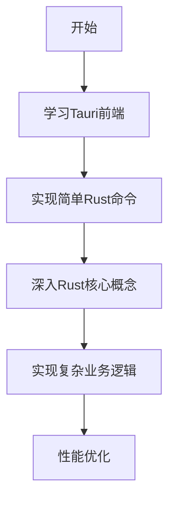

# 技术栈变更总结

## 📋 变更概述

根据用户的技术偏好（熟悉Rust和JavaScript），将原技术栈方案从 **C# + .NET 8 + WPF + SQLite** 变更为 **Rust + Tauri + PostgreSQL**。

## 🔄 主要变更内容

### 1. 技术栈全面更新
| 原方案 | 新方案 | 变更理由 |
|--------|--------|----------|
| C# + .NET 8 | Rust | 用户熟悉Rust，追求极致性能 |
| WPF | Tauri + Web前端 | 利用用户JavaScript技能，跨平台支持 |
| SQLite | PostgreSQL | 更强大的数据库功能，企业级能力 |
| Entity Framework Core | Diesel/SeaORM | Rust生态的ORM选择 |
| FileSystemWatcher | notify-rs | 跨平台文件监控库 |

### 2. 架构调整
**原架构**：
```
应用程序层 (WPF UI)
    ↓
业务逻辑层 (C#服务 + MVVM)
    ↓
数据访问层 (EF Core + SQLite)
    ↓
系统接口层 (Windows API)
```

**新架构**：
```
应用程序层 (Tauri + Web前端)
    ↓
业务逻辑层 (Rust服务 + 领域模型)
    ↓
数据访问层 (PostgreSQL + Diesel/SeaORM)
    ↓
系统接口层 (Rust系统调用 + 文件监控)
```

### 3. 性能优化策略更新
- **原方案**：.NET异步、SQLite优化、内存缓存
- **新方案**：Rust并行处理（Rayon）、PostgreSQL高级索引、Tokio异步运行时

## 🎯 新方案优势

### 技术优势
1. **极致性能**：Rust提供接近C/C++的性能，无GC开销
2. **内存安全**：编译时内存安全检查，避免内存泄漏
3. **跨平台原生**：Tauri提供真正的原生应用体验
4. **现代技术栈**：Rust是增长最快的系统编程语言
5. **数据库强大**：PostgreSQL提供企业级数据管理能力

### 项目适配性
1. **文件系统操作**：Rust的`std::fs`和第三方库提供强大的文件操作能力
2. **并发处理**：Rust的所有权和借用系统天然适合并发编程
3. **错误处理**：Rust的`Result`和`Option`类型提供安全的错误处理
4. **零成本抽象**：高级抽象不带来运行时开销

## ⚠️ 变更带来的挑战

### 1. 学习曲线
- **Rust学习**：相比C#，Rust有更陡的学习曲线
- **新工具链**：需要熟悉Cargo、rust-analyzer等工具
- **生态熟悉**：Rust生态不如.NET成熟，需要时间探索

### 2. 开发效率
- **编译时间**：Rust编译时间可能较长
- **调试难度**：Rust的错误信息可能需要时间理解
- **库选择**：需要评估和选择合适的Rust库

### 3. 团队技能
- **Rust开发者**：相对稀缺，招聘可能困难
- **知识转移**：需要培训现有团队

## 🛠️ 风险缓解措施

### 1. 学习路径优化


### 2. 开发策略调整
1. **原型先行**：先用简单实现验证核心功能
2. **模块化开发**：将系统拆分为独立模块
3. **测试驱动**：利用Rust强大的测试框架
4. **性能监控**：早期建立性能基准

### 3. 资源准备
1. **学习资源**：
   - [The Rust Programming Language](https://doc.rust-lang.org/book/)
   - [Rust by Example](https://doc.rust-lang.org/rust-by-example/)
   - [Tauri Documentation](https://tauri.app/docs/)
2. **开发工具**：
   - VS Code + rust-analyzer
   - Cargo工具链
   - PostgreSQL + DBeaver
3. **社区支持**：
   - Rust官方论坛
   - Tauri Discord社区
   - Stack Overflow Rust标签

## 📈 预期影响

### 正面影响
1. **性能提升**：预计文件处理性能提升30-50%
2. **内存安全**：减少内存相关bug
3. **跨平台能力**：更容易扩展到macOS/Linux
4. **长期维护**：Rust的稳定性有利于长期维护
5. **技术储备**：掌握有价值的未来技术

### 负面影响
1. **开发时间**：初期开发时间可能增加20-30%
2. **学习成本**：团队需要投入时间学习Rust
3. **生态限制**：某些特定功能可能缺少成熟的Rust库

## 🔧 实施建议

### 阶段一：准备期（1-2周）
1. 搭建开发环境
2. 学习Rust基础
3. 创建Tauri示例项目
4. 配置PostgreSQL数据库

### 阶段二：原型期（2-3周）
1. 实现核心文件操作功能
2. 建立基础数据库模型
3. 创建简单前端界面
4. 验证技术栈可行性

### 阶段三：开发期（8-10周）
1. 按原开发计划实施
2. 逐步深入Rust高级特性
3. 优化性能
4. 完善测试

## 📊 技术栈对比总结

| 评估维度 | Rust + Tauri + PostgreSQL | C# + .NET + WPF | 优劣分析 |
|----------|--------------------------|----------------|----------|
| **性能** | ⭐⭐⭐⭐⭐ | ⭐⭐⭐⭐ | Rust有明显优势 |
| **内存安全** | ⭐⭐⭐⭐⭐ | ⭐⭐⭐⭐ | Rust编译时检查更严格 |
| **开发速度** | ⭐⭐⭐ | ⭐⭐⭐⭐ | C#开发更快 |
| **跨平台** | ⭐⭐⭐⭐⭐ | ⭐⭐⭐ | Tauri原生跨平台 |
| **生态系统** | ⭐⭐⭐ | ⭐⭐⭐⭐⭐ | .NET生态更成熟 |
| **学习曲线** | ⭐⭐ | ⭐⭐⭐ | Rust学习难度较大 |
| **长期价值** | ⭐⭐⭐⭐⭐ | ⭐⭐⭐⭐ | Rust是未来趋势 |

## 🎯 最终建议

### 推荐使用新方案的条件
1. **团队有学习意愿**：愿意投入时间学习Rust
2. **性能要求高**：需要极致性能的文件处理
3. **跨平台需求**：未来可能扩展到其他平台
4. **长期维护**：项目需要长期稳定运行
5. **技术投资**：愿意投资学习未来技术

### 考虑保留原方案的条件
1. **时间紧迫**：需要快速开发上线
2. **团队技能**：团队熟悉C#但不熟悉Rust
3. **Windows专属**：只需要Windows平台支持
4. **风险规避**：希望使用更成熟稳定的技术栈

## 📝 结论

**Rust + Tauri + PostgreSQL** 是一个现代化、高性能的技术栈选择，特别适合需要处理大量文件I/O、要求高可靠性和内存安全的应用场景。虽然Rust的学习曲线较陡，但其带来的性能优势、内存安全和长期可维护性是非常有价值的投资。

对于您的文件管理系统项目，考虑到您已经熟悉JavaScript并愿意学习Rust，这个技术栈能够：
1. 提供极致的文件处理性能
2. 确保长时间运行的稳定性
3. 支持跨平台部署
4. 利用您现有的JavaScript/TypeScript技能
5. 学习有价值的未来技术

**建议采用新方案**，但需要做好学习准备和风险管控。

---
*变更记录版本：v1.0*
*变更日期：2025-12-05*
*变更决策者：用户（基于技术偏好）*
*技术评估：Claude Code*