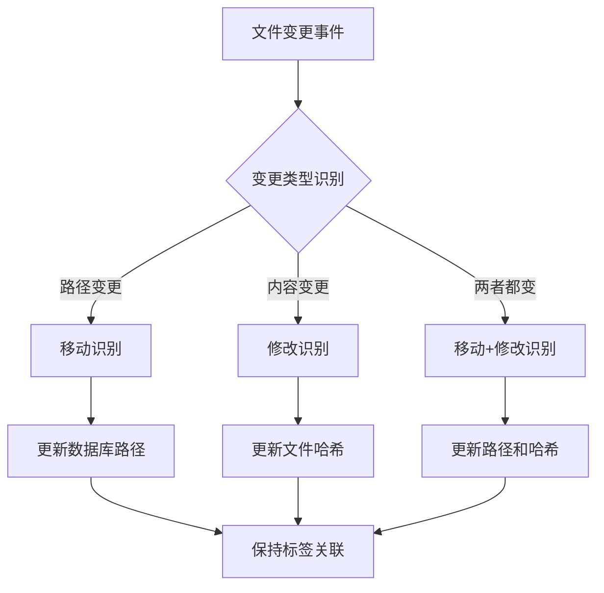

# Windows本地文件管理系统 - 项目总结

## 📋 项目概述

### 项目目标
开发一个基于标签的智能文件管理系统，帮助Windows用户通过标签高效管理大量文件，支持文件移动/修改后的自动识别和标签保持。

### 核心价值主张
1. **智能文件管理**：用标签系统替代传统文件夹分类
2. **快速精准检索**：基于标签的快速文件查找和定位
3. **持久关联**：文件移动或修改后仍能保持标签关联
4. **本地化运行**：数据存储在本地，保护隐私和安全

## 🎯 已完成工作

### 1. 需求分析完成
- 深入理解了用户的核心需求
- 明确了系统的功能边界和约束条件
- 识别了关键的技术挑战和解决方案

### 2. 产品文档体系建立
创建了完整的项目文档体系：

#### 核心文档
1. **[产品需求文档](产品需求文档.md)**
   - 详细的功能需求定义
   - 非功能需求（性能、可靠性、兼容性）
   - 系统架构设计
   - 数据模型设计

2. **[技术栈方案](技术栈方案.md)**
   - 技术选型分析和对比
   - 推荐方案：C# + .NET 8 + WPF
   - 详细的技术组件说明
   - 开发环境配置指南

3. **[README.md](README.md)**
   - 项目概述和核心特性
   - 安装和使用指南
   - 技术架构说明
   - 贡献和许可证信息

4. **[项目开发计划](项目开发计划.md)**
   - 详细的开发阶段划分
   - 时间规划和里程碑
   - 团队角色分工
   - 风险管理和成功指标

### 3. 技术方案设计完成
#### 架构设计
- 四层架构：应用程序层、业务逻辑层、数据访问层、系统接口层
- 前后端分离：Tauri前端 + Rust后端
- 模块化设计：清晰的关注点分离

#### 关键技术方案
- **文件识别**：SHA-256哈希（ring库） + 元数据指纹
- **文件监控**：notify-rs实时监控 + 定时扫描混合策略
- **搜索算法**：倒排索引 + PostgreSQL全文搜索
- **数据库设计**：PostgreSQL + Diesel/SeaORM，高级索引优化

#### 性能优化策略
- Rust并行处理（Rayon）
- 增量哈希计算
- PostgreSQL查询优化
- 异步文件操作（Tokio）

## 🏗️ 系统设计亮点

### 1. 智能文件识别机制

### 2. 标签搜索优化
- **倒排索引**：标签 → 文件列表快速映射
- **布尔逻辑**：支持AND/OR/NOT复杂查询
- **模糊匹配**：前缀、后缀、包含匹配
- **缓存机制**：热门搜索结果缓存

### 3. 数据持久化设计
- **主键设计**：文件哈希作为核心标识
- **变更历史**：完整的文件变更追踪
- **关联置信度**：标签关联的可信度评分
- **软删除**：文件删除后标签数据保留

## 📊 技术选型总结

### 为什么选择 Rust + Tauri + PostgreSQL？
1. **极致性能**：Rust提供接近C/C++的性能，无GC开销
2. **内存安全**：编译时内存安全检查，避免内存泄漏
3. **跨平台原生**：Tauri提供真正的原生应用体验
4. **现代技术栈**：Rust是增长最快的系统编程语言
5. **数据库强大**：PostgreSQL提供企业级数据管理能力

### 备选方案对比
| 特性 | Rust + Tauri + PostgreSQL | C# + .NET + WPF | Python + PyQt | Electron |
|------|--------------------------|----------------|---------------|----------|
| 性能 | ⭐⭐⭐⭐⭐ | ⭐⭐⭐⭐ | ⭐⭐⭐ | ⭐⭐ |
| 内存安全 | ⭐⭐⭐⭐⭐ | ⭐⭐⭐⭐ | ⭐⭐⭐ | ⭐⭐⭐ |
| Windows集成 | ⭐⭐⭐⭐ | ⭐⭐⭐⭐⭐ | ⭐⭐⭐ | ⭐⭐ |
| 跨平台能力 | ⭐⭐⭐⭐⭐ | ⭐⭐⭐ | ⭐⭐⭐⭐ | ⭐⭐⭐⭐⭐ |
| 安装包大小 | ⭐⭐⭐⭐ | ⭐⭐⭐⭐ | ⭐⭐ | ⭐ |
| 学习曲线 | ⭐⭐ | ⭐⭐⭐ | ⭐⭐⭐⭐ | ⭐⭐⭐⭐ |

## 🚀 下一步行动计划

### 立即开始（第1周）
1. **环境搭建**
   - 安装 Rust工具链（rustup）
   - 配置 Node.js + npm/yarn/pnpm
   - 安装 PostgreSQL 15+（或使用Docker）
   - 设置 Git 仓库

2. **项目初始化**
   - 创建Tauri项目结构
   - 配置 Cargo.toml 和 package.json
   - 建立数据库迁移（Diesel）

3. **核心服务实现**
   - 文件指纹服务（Rust实现）
   - 基础标签管理
   - 数据库访问层（Diesel/SeaORM）

### 短期目标（1-4周）
- 完成基础框架搭建
- 实现核心数据模型
- 建立可运行的Alpha版本
- 完成第一阶段功能验收

### 中期目标（5-8周）
- 完善文件监控系统
- 实现高级搜索功能
- 优化用户体验
- 发布Beta测试版本

### 长期目标（9-13周）
- 性能优化和测试
- 安装部署方案
- 正式发布v1.0
- 用户反馈收集

## ⚠️ 关键风险与应对

### 技术风险
1. **文件监控性能**
   - **风险**：实时监控可能影响系统性能
   - **应对**：增量扫描、用户可配置监控频率

2. **大文件处理**
   - **风险**：大文件哈希计算耗时
   - **应对**：增量哈希算法、后台任务、进度提示

3. **数据库并发**
   - **风险**：多线程访问可能导致冲突
   - **应对**：事务管理、重试机制、乐观锁

### 项目风险
1. **需求变更**
   - **风险**：开发过程中需求可能变化
   - **应对**：敏捷开发、优先级管理、范围控制

2. **时间压力**
   - **风险**：13周时间可能紧张
   - **应对**：MVP思维、核心功能优先、灵活调整计划

## 📈 成功指标定义

### 开发过程指标
- 代码质量：静态分析警告数 < 10
- 测试覆盖率：核心代码 > 85%
- 构建成功率：> 95%
- Bug解决时间：严重bug < 24小时

### 产品指标
- 性能：搜索响应 < 1秒，内存 < 200MB
- 质量：崩溃率 < 0.1%，识别准确率 > 99%
- 用户满意度：> 4.5/5 评分

## 💡 创新点总结

### 技术创新
1. **Rust高性能实现**：内存安全、极致性能的文件处理
2. **混合文件识别**：内容哈希 + 元数据指纹组合
3. **智能变更检测**：notify-rs实时监控 + 定时扫描
4. **标签持久化**：文件移动/修改后自动关联保持
5. **增量哈希算法**：大文件高效处理（Rust并行）

### 用户体验创新
1. **现代Web界面**：Tauri提供流畅的Web前端体验
2. **拖拽标签**：直观的文件标记方式
3. **智能搜索**：标签组合 + PostgreSQL全文搜索
4. **跨平台支持**：Windows/macOS/Linux原生体验
5. **数据安全**：完全本地化运行 + Rust内存安全

## 🤝 团队协作建议

### 开发团队配置（建议）
- Rust后端开发：2人（数据库、核心服务、系统集成）
- 前端开发：1人（Tauri前端、用户体验）
- 测试工程师：1人（可兼职）

### 协作流程
- **迭代开发**：每2周一个迭代周期
- **代码审查**：所有PR必须经过审查
- **持续集成**：自动构建和测试
- **文档驱动**：代码变更伴随文档更新

## 🎯 项目愿景

### 短期愿景（v1.0）
创建一个基于Rust的高性能、内存安全的本地文件标签管理系统，提供流畅的Tauri前端体验。

### 中期愿景（v2.0）
引入AI智能标签、云同步、跨平台支持等高级功能，成为个人文件管理的首选工具。

### 长期愿景
构建一个完整的个人知识管理系统，整合文件管理、笔记、任务管理等功能，利用Rust的性能优势处理大规模数据。

## 📞 后续支持

### 技术咨询
- 架构设计问题
- 技术选型建议
- 性能优化指导

### 项目管理
- 进度跟踪方法
- 风险管理策略
- 团队协作建议

### 产品规划
- 功能优先级排序
- 用户反馈处理
- 版本发布策略

---

**项目状态**：规划设计阶段完成 ✅
**下一步**：进入开发实施阶段 🚀
**文档版本**：v1.0
**完成日期**：2025-12-05
**负责人**：项目规划团队